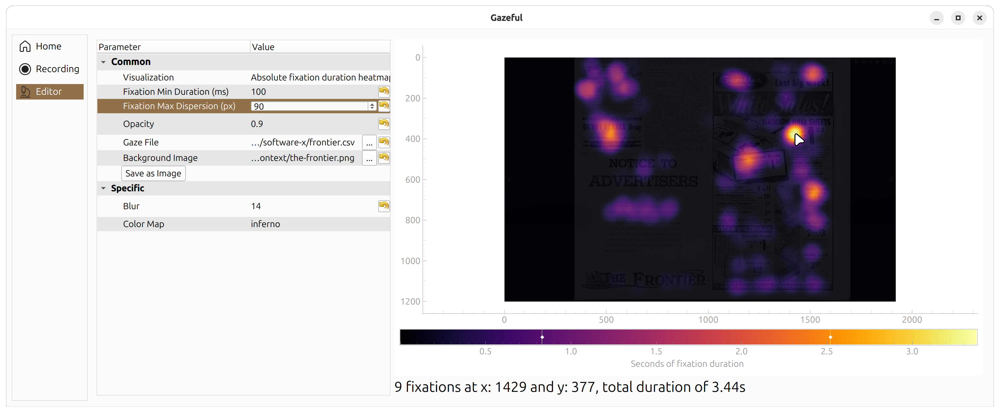

# Gazeful

<!--toc:start-->
- [Gazeful](#gazeful)
  - [Hardware Support](#hardware-support)
  - [Supported Platforms](#supported-platforms)
  - [Features](#features)
  - [Getting Started](#getting-started)
    - [1. Clone the Repository](#1-clone-the-repository)
    - [2. Create a Virtual Environment](#2-create-a-virtual-environment)
    - [3. Activate the Virtual Environment](#3-activate-the-virtual-environment)
      - [Linux / macOS (BASH or Zsh)](#linux-macos-bash-or-zsh)
      - [Windows (PowerShell)](#windows-powershell)
      - [Windows (Command Prompt)](#windows-command-prompt)
    - [4. Install Dependencies](#4-install-dependencies)
  - [Usage](#usage)
  - [Data Format](#data-format)
  - [Development and Contributing](#development-and-contributing)
<!--toc:end-->

Gazeful is an open-source desktop graphical environment, acting as an end-to-end
workflow for integrated eye-tracking data acquisition and interactive gaze
visualization.

A screenshot of the analysis view:


A figure presenting the Gazeful workflow:


## Hardware Support

| Hardware | Status | Notes |
| --- | --- | --- |
| Tobii Pro Spark | Working | Used throughout development |
| Other Tobii SDK trackers | Untested | Expected to work |
| Other screen-mounted trackers | Currently unsupported | |
| Head-mounted trackers | Unsupported | |

## Supported Platforms

Gazeful is written with Python and aims to be cross-platform, but testing
coverage varies.

| Platform | Status | Notes |
| --- | --- | --- |
| Windows | Fully functional | Tested on Windows 11 |
| Linux (X11) | Fully functional | Tested on Mint 22.3 |
| Linux (Wayland) | Partial | Gaze visualizer overlay and taking screenshots not supported. Tested on Ubuntu 25.10 |
| macOS | Fully functional | Tested on Tahoe 26.3.1 with an M4 Pro processor |

## Features

- Data Acquisition:
    Gazeful supports direct recording of screen-based eye tracker data from a
    single participant at a time.
    Recordings are saved to `.csv` files,
    [examples of which you can find here](./tests/samples/).

- Mouse Emulation:
    Mouse movements may be used to simulate eye tracker data acquisition, where
    the position of the cursor represents human gaze.
    The feature allows for development, demonstration, and exploration of the
    tool without an eye tracker.

- Gaze Visualizer:
    When an eye tracker is connected to Gazeful, a visualizer may be enabled,
    displaying the participant's current eye position as an overlay on the
    screen.

- Automatic Processing:
    After recording has been finished, or a `.csv` file is manually loaded,
    Gazeful automatically processes the raw data into fixations using an
    implementation of dispersion-threshold identification.

- Editor:
    Once the data has been processed, it may be interactively explored in the
    Editor view.
    The Editor features:

  - A choice between absolute fixation duration heatmaps, fixation count
    heatmaps, and gaze plots.
    The visualization may be changed at any time.

  - Parameters necessary for identification by dispersion-threshold.
    Changing these will automatically reprocess the data.

  - Visualization parameters, such as the heatmap color scale, opacity,
    blur strength, gaze plot connection and spot colors.

  - Interactive analysis.
    Heatmap color scales can be moved to emphasize or suppress fixation regions.
    Both heatmaps and gaze plots utilize hover-based interaction, where hovering
    over fixations will display quantitative information, such as duration and
    location.
    Hovering over fixations in the gaze plot will additionally highlight
    adjacent fixations.

## Getting Started

The following section outlines how to set up Gazeful.

- Python 3.10 is required.
- Dependencies are listed in [requirements.txt](./requirements.txt).
- Using a virtual environment is recommended.

### 1. Clone the Repository

```bash
git clone git@github.com:krznck/gazeful.git
cd gazeful
```

### 2. Create a Virtual Environment

All platforms:

```bash
python -m venv .venv
```

### 3. Activate the Virtual Environment

#### Linux / macOS (BASH or Zsh)

```bash
source .venv/bin/activate
```

#### Windows (PowerShell)

```powershell
.venv\Scripts\Activate.ps1
```

> If PowerShell blocks activation, you may need to run:
>
> ```powershell
> Set-ExecutionPolicy -ExecutionPolicy RemoteSigned -Scope CurrentUser
> ```

#### Windows (Command Prompt)

```cmd
.venv\Scripts\activate.bat
```

### 4. Install Dependencies

All platforms:

```bash
pip install --requirement requirements.txt
```

## Usage

Run the application:

```bash
python main.py
```

## Data Format

Gazeful uses a standardized CSV format for gaze data acquisition and processing.
For technical details on the format (useful for integrating eye trackers or
converting existing recordings), see the
[Development Guide](./DEVELOPMENT.md#data-interchange).

## Development and Contributing

For detailed information on the project's internals, please refer to the
[Development Guide](./DEVELOPMENT.md).

It covers:

- **Architecture Overview**: Our Model-View-Presenter (MVP) implementation.
- **Data Format**: Detailed CSV specification for eye-tracking data.
- **Extending Gazeful**: How to add new eye trackers or visualization strategies.
- **Standards**: Guidelines for static typing, formatting, and commits.
