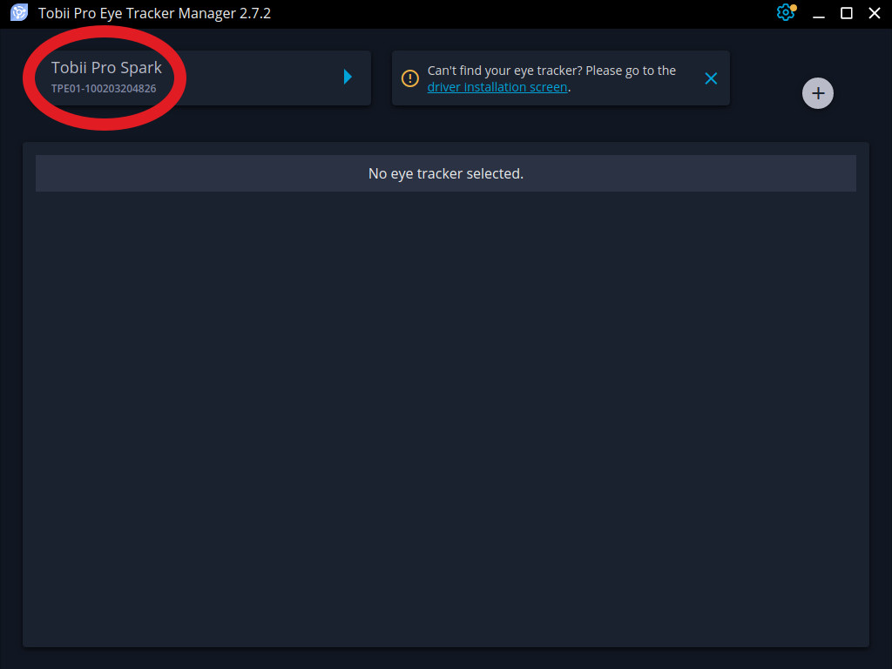
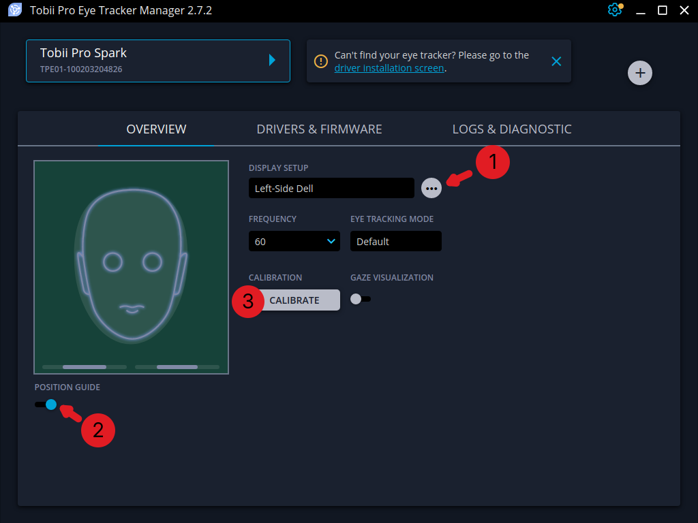

# Calibrating The Tobii Pro Spark

Before each recording session, an eye-tracker should be calibrated to the
participant.

Currently, Gazeful only supports the Tobii Pro Spark.
As future eye trackers are added to Gazeful, this page will change to reflect
new instructions.

As Tobii provides a free and cross-platform calibration utility in the form of
the 
[Tobii Pro Eye Tracker Manager](https://www.tobii.com/products/software/applications-and-developer-kits/tobii-pro-eye-tracker-manager)
, Gazeful does not re-implement the wheel.

## Instructions

Calibration may be done at any point, excluding when actively recording gaze
data.
Gazeful may be opened or closed.
The tracker being calibrated may be connected or disconnected within Gazeful.

1. Download install, and run the
[Tobii Pro Eye Tracker Manager](https://www.tobii.com/products/software/applications-and-developer-kits/tobii-pro-eye-tracker-manager).
1. Connect your Tobii Pro Spark to the computer.
1. After a few seconds, the manager should display the Spark in the top left.
   Click on the tracker name to select it.
   
1. After selecting the tracker:
    
    1. Add the display to which your Tobii Pro Spark is attached, following the
       instructions within the app.
    1. Enable the position guide and ensure your participant is seated and
       oriented such that the guide is showing green.
    3. Click "Calibrate".
1. Have your participants follow the instructions on the screen.

After calibration, you may use the Tobii Pro Eye Tracker Manager "Gaze
Visualization" button to validate whether the participants gaze is detected at
the correct positions within the manager app.
Alternatively, you can use the gaze visualizer feature within Gazeful (not
available on Wayland Linux) for the same purpose, without the need to have a
specific app in the foreground.
